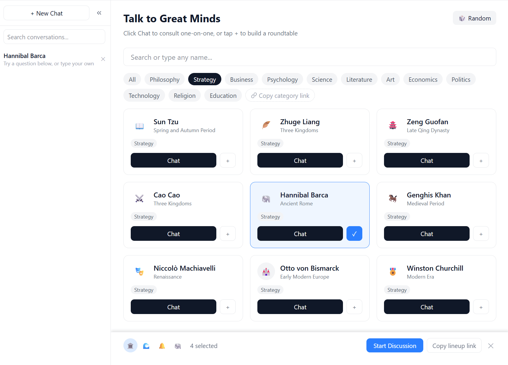

<h1 align="center">Legend Talk</h1>

<p align="center">
  ৩৬৫ ওপেন সোর্স পরিকল্পনা #০০২ · ইতিহাসের মহান চিন্তাবিদদের সাথে AI গোলটেবিল আলোচনা
</p>

<p align="center">
  <a href="../README.md">English</a> ·
  <a href="../README.zh.md">中文</a> ·
  <a href="README.zh-Hant.md">繁體中文</a> ·
  <a href="README.ja.md">日本語</a> ·
  <a href="README.ko.md">한국어</a> ·
  <a href="README.es.md">Español</a> ·
  <a href="README.fr.md">Français</a> ·
  <a href="README.de.md">Deutsch</a> ·
  <a href="README.pt.md">Português</a> ·
  <a href="README.it.md">Italiano</a> ·
  <a href="README.ru.md">Русский</a> ·
  <a href="README.ar.md">العربية</a> ·
  <a href="README.hi.md">हिन्दी</a> ·
  <a href="README.vi.md">Tiếng Việt</a> ·
  <a href="README.th.md">ไทย</a> ·
  <a href="README.tr.md">Türkçe</a> ·
  <a href="README.id.md">Indonesia</a>
</p>

বিশ্বের মহান চিন্তাবিদদের একত্রিত করুন এবং তাদের আপনার সমস্যা নিয়ে বিতর্ক করতে দিন।

Legend Talk একটি বহু-রাউন্ড AI গোলটেবিল আলোচনা টুল — ২-১০ জন ব্যক্তিত্ব বেছে নিন এবং বিতর্ক দেখুন।

১-১ টুল হিসেবেও কাজ করে: ১৪০+ চিন্তাবিদের সাথে পরামর্শ করুন।

**ডেমো:** [talk.newzone.top](https://talk.newzone.top)

## স্ক্রিনশট

| হোম | চ্যাট |
|:-:|:-:|
|  |  |

## ব্যবহার

### ১-১ চ্যাট

যেকোনো কার্ডে **চ্যাট** বোতামে ক্লিক করুন।

### গোলটেবিল

২-১০ কার্ডে **+** ক্লিক করুন। অথবা **🎲 এলোমেলো** তে ৫ জন।

### টেমপ্লেট

৬টি গোলটেবিল টেমপ্লেট যেখানে দৃষ্টিভঙ্গি সংঘর্ষে আসে।

### কথোপকথনের সময়

- **থামান** — বাতিল
- **অংশগ্রহণকারী যোগ/সরান**
- **রাউন্ড সেট করুন**
- **চালিয়ে যান**
- **পুনরায় শুরু**
- **সারসংক্ষেপ** — AI সারসংক্ষেপ
- **শেয়ার**
- **রপ্তানি** — Markdown, JSON বা [json2card](https://github.com/rockbenben/json2card) দিয়ে শেয়ার কার্ড তৈরি করুন (সেটিংসে API এন্ডপয়েন্ট কনফিগার করুন)
- **আমদানি**
- **শাখা**

### সরাসরি লিঙ্ক

URL দিয়ে শুরু করুন:

- **নাম দিয়ে:** `/#/chat?chars=Socrates,Confucius`
- **ID দিয়ে:** `/#/chat?chars=socrates,confucius`
- **বিভাগ দিয়ে:** `/#/chat?category=philosophy`
- **একক চ্যাট:** `/#/chat?chars=socrates`
- **কাস্টম নাম:** `/#/chat?chars=Ada Lovelace,Linus Torvalds` (অপরিচিত নাম স্বয়ংক্রিয়ভাবে চরিত্র তৈরি করে)

উপলব্ধ বিভাগ: `philosophy`, `strategy`, `business`, `finance`, `history`, `sociology`, `psychology`, `science`, `literature`, `art`, `economics`, `politics`, `technology`, `religion`, `education`

ইন্টারফেস থেকেও লিঙ্ক তৈরি করা যায়।

**ভাষা রাউটিং:** URL-এ ভাষা উপসর্গ। ১৮ ভাষা।

## আরও বৈশিষ্ট্য

উপরের ছাড়াও:

- **১৪০+ চিন্তাবিদ** ১৫টি ক্ষেত্রে
- **কাস্টম চরিত্র**
- **অনুসন্ধান** · **পছন্দের** · **সিঙ্ক** (AES)
- **চিন্তার মাত্রা** · **কাস্টম মডেল** · **কাস্টম LLM**
- **মাল্টি-API**: OpenAI, Anthropic, DeepSeek + ৫ অন্যান্য
- **১৮ ভাষা** · **ডার্ক মোড** · **রেসপনসিভ** · **লোকাল-ফার্স্ট**

## সমর্থিত API

| Provider | Models |
|----------|--------|
| OpenAI | GPT-5.4, GPT-5.4 Mini/Nano, o4 Mini, o3, GPT-4.1 series |
| Anthropic | Claude Opus 4.6, Claude Sonnet 4.6, Claude Haiku 4.5 |
| DeepSeek | DeepSeek Chat, DeepSeek Reasoner |
| Volcengine | Doubao Seed 2.0 Pro, Doubao 1.5 series, DeepSeek R1/V3 |
| Alibaba Bailian | Qwen 3.5 Plus, Kimi K2.5, GLM-5, MiniMax M2.5, etc. |
| SiliconFlow | DeepSeek V3/R1, Qwen 2.5 series |
| Groq | LLaMA 4 Scout/Maverick, DeepSeek R1 |
| OpenRouter | Any model via OpenRouter catalog |

সবগুলো কাস্টম মডেল ID সমর্থন করে। ডিফল্ট: DeepSeek Chat।

## দ্রুত শুরু

```bash
npm install
npm run dev
```

http://localhost:5173 খুলুন, সেটিংসে API কী দিন।

## CORS প্রক্সি

কিছু প্রদানকারী সরাসরি অনুরোধ ব্লক করে। প্রদানকারী অনুযায়ী CORS প্রক্সি কনফিগার করুন।

নিজের প্রক্সি তৈরি করতে [Cloudflare Worker](https://dash.cloudflare.com) তৈরি করুন:

<details>
<summary>Worker code</summary>

```javascript
export default {
  async fetch(request) {
    const url = new URL(request.url);
    const targetUrl = url.pathname.slice(1) + url.search;
    if (!targetUrl || !targetUrl.startsWith('https://')) {
      return new Response('Usage: /https://target-api.com/path', { status: 400 });
    }
    if (request.method === 'OPTIONS') {
      return new Response(null, {
        headers: {
          'Access-Control-Allow-Origin': '*',
          'Access-Control-Allow-Methods': 'GET, POST, PUT, DELETE, OPTIONS',
          'Access-Control-Allow-Headers': '*',
          'Access-Control-Max-Age': '86400',
        },
      });
    }
    const response = await fetch(targetUrl, {
      method: request.method,
      headers: request.headers,
      body: request.body,
    });
    const newResponse = new Response(response.body, response);
    newResponse.headers.set('Access-Control-Allow-Origin', '*');
    return newResponse;
  },
};
```

</details>

## প্রকল্প কাঠামো

```
src/
  adapters/       # LLM API adapters (OpenAI, Anthropic, etc.)
  characters/     # Character presets and custom character generation
  components/     # React components
  hooks/          # useChat, useRoundtable
  i18n/           # Internationalization
  stores/         # Zustand state management
  utils/          # Prompt building, export, compression, storage
  types.ts        # Type definitions
```

## প্রযুক্তি স্ট্যাক

React 19, Vite, Tailwind CSS v4, Zustand, i18next, React Router, TypeScript

## স্ক্রিপ্ট

| কমান্ড | বিবরণ |
|--------|--------|
| `npm run dev` | ডেভ সার্ভার |
| `npm run build` | টাইপ চেক + বিল্ড |
| `npm run test` | টেস্ট |
| `npm run preview` | বিল্ড প্রিভিউ |

## ডিপ্লয়

বিল্ড করুন এবং `dist/` যেকোনো স্ট্যাটিক হোস্টিং-এ ডিপ্লয় করুন:

```bash
npm run build
```

হ্যাশ রাউটিং (`/#/chat/...`) ব্যবহার করে, সার্ভার কনফিগারেশন প্রয়োজন নেই।

## ৩৬৫ পরিকল্পনা সম্পর্কে

এটি [৩৬৫ ওপেন সোর্স পরিকল্পনা](https://github.com/rockbenben/365opensource) এর #০০২ প্রকল্প।

১ জন + AI, এক বছরে ৩০০+ ওপেন সোর্স প্রকল্প। [আপনার আইডিয়া জমা দিন →](https://my.feishu.cn/share/base/form/shrcnI6y7rrmlSjbzkYXh6sjmzb)

## License

MIT
