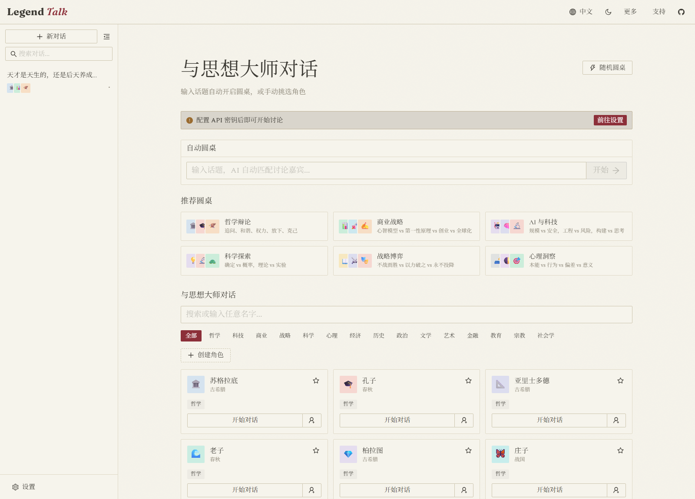
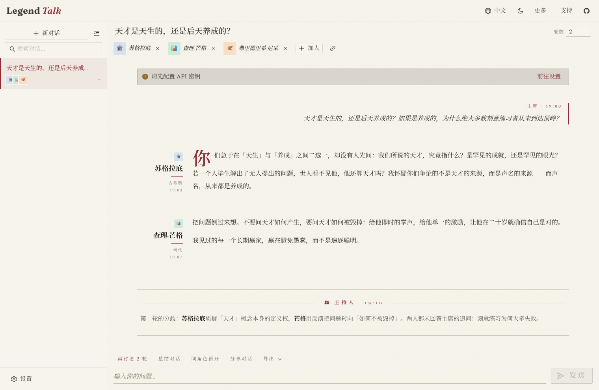

<p align="center">
  
</p>

<h1 align="center">Legend Talk</h1>

<p align="center">
  Piano Open Source 365 #002 · Tavola rotonda IA con i più grandi pensatori della storia
</p>

<p align="center">
  <a href="../README.md">English</a> ·
  <a href="../README.zh.md">中文</a> ·
  <a href="README.zh-Hant.md">繁體中文</a> ·
  <a href="README.ja.md">日本語</a> ·
  <a href="README.ko.md">한국어</a> ·
  <a href="README.es.md">Español</a> ·
  <a href="README.fr.md">Français</a> ·
  <a href="README.de.md">Deutsch</a> ·
  <a href="README.pt.md">Português</a> ·
  <a href="README.ru.md">Русский</a> ·
  <a href="README.ar.md">العربية</a> ·
  <a href="README.hi.md">हिन्दी</a> ·
  <a href="README.vi.md">Tiếng Việt</a> ·
  <a href="README.th.md">ไทย</a> ·
  <a href="README.tr.md">Türkçe</a> ·
  <a href="README.id.md">Indonesia</a> ·
  <a href="README.bn.md">বাংলা</a>
</p>

> **Riunisci i più grandi pensatori della storia a un'unica tavola e lascia che discutano il tuo problema.**

Legend Talk convoca da 2 a 10 pensatori storici o contemporanei in un dibattito multi-round. A ogni round, ogni voce argomenta dal proprio quadro di pensiero; un moderatore mappa poi i disaccordi e apre il round successivo. Socrate incalza le ipotesi di Munger mentre Nietzsche sfida entrambi.

**Tre modi per iniziare:**

- **Poni una domanda** — scrivi un argomento e l'IA assembla un panel di 3-5 pensatori costruito per generare una tensione produttiva.
- **Apparecchia la tavola** — scegli a mano da 2 a 10 pensatori, oppure tirane 5 a caso.
- **Consulta una sola mente** — vai 1 a 1 con uno qualsiasi dei 161 pensatori, ciascuno dei quali ragiona attraverso il proprio quadro di pensiero, non un generico role-play IA.

**Demo:** [talk.newzone.top](https://talk.newzone.top) — 18 lingue · gratis · local-first · senza registrazione.

## Screenshot

| Home | Chat |
|:-:|:-:|
|  |  |

## Avvia una conversazione

**Tavola rotonda automatica** — inserisci un argomento nella barra di input della home page. L'IA sceglie 3-5 pensatori le cui visioni sono realmente in conflitto e avvia subito il dibattito, senza bisogno di selezionare personaggi.

**Tavola rotonda manuale** — clicca su **+** su 2-10 carte personaggio per comporre una formazione. Una barra fluttuante mostra le tue scelte:

- Clicca su un avatar per rimuoverlo
- **Avvia discussione** per lanciare
- **Copia link formazione** per condividere la formazione esatta come URL

Oppure premi **🎲 Casuale** (in alto a destra) per iniziare all'istante con 5 pensatori casuali.

**Modelli in evidenza** — 6 formazioni curate le cui prospettive sono realmente in conflitto (es. *IA & Tech*: Karpathy vs Ilya vs Feynman vs Taleb vs Paul Graham). Un clic per iniziare, ciascuna con 3 argomenti suggeriti.

**Chat 1 a 1** — clicca su **Chat** su qualsiasi carta personaggio per una conversazione privata con la voce e il quadro di pensiero di quel pensatore.

**Suggerimenti di argomenti** — prima del tuo primo messaggio, ogni modalità propone argomenti per iniziare: 3 domande curate per modello (in tutte le 18 lingue), oppure 1 domanda tratta da ciascun pensatore selezionato in una formazione manuale (si aggiornano man mano che aggiungi o rimuovi persone).

## Guida la discussione

Siedi a capotavola come **presidente** (chair) — il dibattito procede alle tue condizioni.

- **Moderatore** — dopo ogni round, un moderatore IA lo sintetizza: raggruppa le affermazioni per idea, nomina un angolo che il round ha lasciato intatto e pone una domanda aperta per quello successivo.
- **Rifocalizza a metà dibattito** — invia un messaggio durante una tavola rotonda per reindirizzarla. Invece di avviarsi automaticamente, compare una **scheda di focus** modificabile; si impila sopra qualsiasi focus precedente, così i reindirizzamenti anteriori non vanno persi. Affinala, poi premi **Avvia** per ancorare i round successivi su di essa.
- **Applica e riprova** — modifica qualsiasi messaggio e rigenera da quel punto. I reindirizzamenti del presidente portano con sé uno snapshot del focus, così una nuova generazione ricostruisce dall'esatto stato di focus attivo quando il messaggio è stato inviato.
- **Imposta i round** — scegli quanti round i pensatori dibattono prima di una pausa, e **Continua** per aggiungerne altri al termine.
- **Aggiungi o rimuovi partecipanti** in qualsiasi momento — trasforma una chat 1 a 1 in una tavola rotonda, o viceversa.
- **Stop** — annulla la generazione a metà stream; tutto ciò che è già stato scritto viene conservato.
- **Biforca** — crea una nuova conversazione a partire da qualsiasi messaggio, portando con sé il contesto precedente.

## Salva, cerca e condividi

- **Riassumi** — riassunto IA con un clic che estrae i punti di vista e i disaccordi fondamentali.
- **Ricerca** — trova qualsiasi cosa in tutte le conversazioni per titolo, nome del pensatore o contenuto del messaggio.
- **Preferiti** — metti tra i preferiti i pensatori che usi di più per un accesso rapido.
- **Condividi chat** — genera un URL che contiene l'intera conversazione.
- **Esporta / Importa** — salva come Markdown o JSON e ripristina da JSON (nelle Impostazioni), oppure genera schede di condivisione tramite [json2card](https://github.com/rockbenben/json2card) (imposta l'endpoint API nelle Impostazioni).
- **Sincronizzazione impostazioni** — sposta la tua configurazione su un altro dispositivo tramite URL; le chiavi API sono cifrate con AES.

## Pensatori, modelli e piattaforma

**161 pensatori preimpostati** in 15 domini, ordinati per notorietà — scrivi un nome qualsiasi per creare al volo un personaggio personalizzato.

**Modelli** — imposta il **livello di pensiero** (off / basso / medio / alto), inserisci un **ID modello personalizzato** o connetti qualsiasi **API compatibile con OpenAI** come provider personalizzato. Default: DeepSeek V4 Flash.

**Piattaforma** — 18 lingue · modalità scura · responsive · **local-first** (doppia scrittura IndexedDB + localStorage, funziona in WeChat e nei WebView ristretti) · **zero CDN** (font self-hosted e inclusi nel bundle, così funziona offline e dietro i firewall).

## Link diretti

Avvia una conversazione direttamente da un URL:

- **Per nome:** `/#/chat?chars=苏格拉底,孔子` o `/#/chat?chars=Socrates,Confucius`
- **Per ID:** `/#/chat?chars=socrates,confucius`
- **Per categoria:** `/#/chat?category=philosophy` (tavola rotonda con ogni pensatore di quella categoria, fino a un massimo di 10)
- **Chat singola:** `/#/chat?chars=socrates`
- **Nomi personalizzati:** `/#/chat?chars=Ada Lovelace,Linus Torvalds` (i nomi non riconosciuti diventano personaggi personalizzati)

Categorie: `philosophy`, `strategy`, `business`, `finance`, `history`, `sociology`, `psychology`, `science`, `literature`, `art`, `economics`, `politics`, `technology`, `religion`, `education`.

I pulsanti **Copia link formazione** (barra dei partecipanti) e **Copia link categoria** (filtro categoria) generano questi URL dall'interfaccia.

**Routing linguistico** — anteponi all'URL una lingua per impostare la lingua dell'interfaccia, es. `/#/ja/chat`, `/#/ko/chat?chars=socrates`, oppure usa `?lang=zh`. Tutte le 18 lingue sono supportate.

## API supportate

24 provider pronti all'uso — internazionali, con sede in Cina e aggregatori:

| Provider | Models |
|----------|--------|
| OpenAI | GPT-5.5, GPT-5.4, GPT-5.4 Mini |
| Anthropic | Claude Opus 4.7, Claude Sonnet 4.6, Claude Haiku 4.5 |
| Google Gemini | Gemini 3.1 Pro, Gemini 3.5 Flash |
| xAI Grok | Grok 4.3, Grok 4.20 series |
| Mistral / Cohere | Mistral Medium 3.5 / Large 3, Command A series |
| DeepSeek | DeepSeek V4 Flash, V4 Pro |
| Moonshot / Kimi | Kimi K2.6, K2.5 |
| Zhipu GLM | GLM-5.1, GLM-5, GLM-4.7 series |
| MiniMax / Hunyuan / Qianfan / MiMo | MiniMax M2.7, Hunyuan 2.0, ERNIE 5.1, MiMo V2.5 |
| Volcengine Coding Plan | Doubao Seed 2.0, Kimi K2.5, GLM-4.7, DeepSeek V4 |
| Alibaba Bailian Coding Plan | Qwen 3.6 Max/Plus/Flash, Kimi K2.5, GLM-5 |
| Aggregators | OpenRouter, SiliconFlow, Groq, Cerebras, Together, Fireworks, Perplexity, NVIDIA NIM, GitHub Models |

Ogni provider accetta ID modello personalizzati, e l'opzione **Custom** connette qualsiasi API compatibile con OpenAI.

## Avvio rapido

```bash
npm install
npm run dev
```

Apri http://localhost:5173, vai su Impostazioni, inserisci la tua chiave API e inizia a chattare. Se incontri un errore CORS, l'app propone di abilitare un proxy pubblico con un clic.

## Proxy CORS

Alcuni provider bloccano le richieste dirette dal browser. Il proxy CORS si configura per provider nelle Impostazioni — attivalo. Per default viene usato un proxy pubblico (`https://cors.api2026.workers.dev`).

Per eseguire il tuo, distribuisci un [Cloudflare Worker](https://dash.cloudflare.com) con questo codice:

<details>
<summary>Worker code</summary>

```javascript
export default {
  async fetch(request) {
    const url = new URL(request.url);
    const targetUrl = url.pathname.slice(1) + url.search;
    if (!targetUrl || !targetUrl.startsWith('https://')) {
      return new Response('Usage: /https://target-api.com/path', { status: 400 });
    }
    if (request.method === 'OPTIONS') {
      return new Response(null, {
        headers: {
          'Access-Control-Allow-Origin': '*',
          'Access-Control-Allow-Methods': 'GET, POST, PUT, DELETE, OPTIONS',
          'Access-Control-Allow-Headers': '*',
          'Access-Control-Max-Age': '86400',
        },
      });
    }
    const response = await fetch(targetUrl, {
      method: request.method,
      headers: request.headers,
      body: request.body,
    });
    const newResponse = new Response(response.body, response);
    newResponse.headers.set('Access-Control-Allow-Origin', '*');
    return newResponse;
  },
};
```

</details>

## Sviluppo

```
src/
  adapters/       # LLM API adapters (OpenAI-compatible, Anthropic)
  characters/     # Character presets and custom character generation
  components/     # React components
  hooks/          # useChat, useRoundtable
  i18n/           # Internationalization
  stores/         # Zustand state management
  utils/          # Prompt building, export, compression, storage
  types.ts        # Type definitions
```

**Stack:** React 19 · antd 6 (tema a variabili CSS, profondamente personalizzato) · Vite · Tailwind CSS v4 · Zustand · i18next · React Router · TypeScript

| Comando | Descrizione |
|---------|-------------|
| `npm run dev` | Avvia il server di sviluppo |
| `npm run build` | Verifica tipi e build per produzione |
| `npm run test` | Esegui i test |
| `npm run preview` | Anteprima della build di produzione |

## Deploy

Compila e ospita la cartella `dist/` su qualsiasi hosting statico (Vercel, Netlify, GitHub Pages, …):

```bash
npm run build
```

Il routing è basato su hash (`/#/chat/...`, `/#/ja/chat/...`), quindi non serve alcuna configurazione di routing lato server.

## Info sul Piano Open Source 365

Questo è il progetto #002 del [Piano Open Source 365](https://github.com/rockbenben/365opensource) — una persona + IA, 300+ progetti open source in un anno. [Invia la tua idea →](https://my.feishu.cn/share/base/form/shrcnI6y7rrmlSjbzkYXh6sjmzb)

## License

MIT
